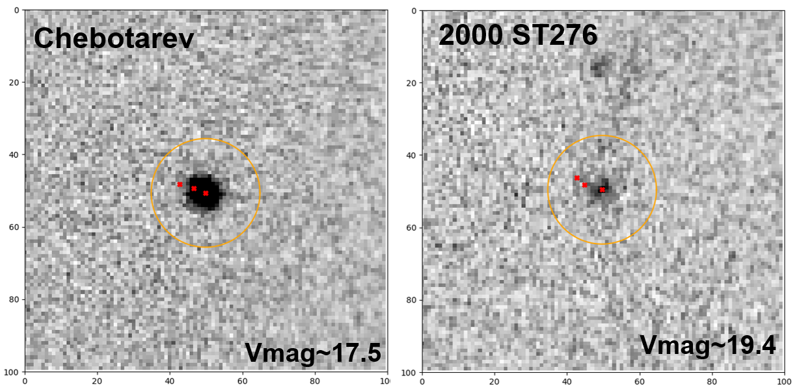

# Twilight_Asteroid_Search

This pipeline is designed to search for asteroids during twilight periods. It automates the creation of all necessary documents required to use the software findPOTATOs to identify moving sources. Additionally, the pipeline will characterize all your findings, providing the necessary information to determine whether a detection is a false positive or a potential new asteroid discovery.

## Structure of the pipeline

The pipeline consists of three main scripts that need to be executed sequentially:

1. **`main.py`**: This script prepares the data required to run the software **findPOTATOs**.
2. **`main2.py`**: After running **findPOTATOs**, execute this script to generate a `.csv` file that characterizes the detected moving sources (tracklets).
3. **`main3.py`**: The third script generates images, GIFs, and a statistical summary of the findings.
